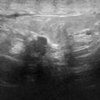
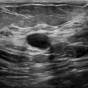
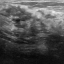
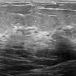

# Breast Cancer Detection with Deep Learning in PyTorch

<p align="center">
  
  
  
  
  
</p>

This is an end-to-end **computer vision** project that classifies breast ultrasound images as **benign** or **malignant** using **deep learning models implemented in PyTorch**, an industry-standard framework.

The project covers the full **ML engineering lifecycle**: exploring and preprocessing data, training a convolutional neural network with variations in dropout, learning rate scheduling, and data augmentation, exporting models to scripts, containerizing the application with **Docker**, serving predictions via **FastAPI**, and deploying to the **cloud ([Fly.io](https://fly.io))**.

This repository demonstrates how machine learning models move from **research to production** in a modular, reproducible, and deployable setup.

> **Note:** This project was completed as part of the [**Machine Learning Zoomcamp**](https://github.com/DataTalksClub/machine-learning-zoomcamp), a free, global course on ML engineering taught by [Alexey Grigorev](https://github.com/alexeygrigorev) and the DataTalks.Club team. It provided a structured, hands-on environment to apply ML concepts and practice deploying real-world applications.

## Table of Contents

- [Tech Stack](#tech-stack)
- [Problem Description](#problem-description)
- [Dataset](#dataset)
- [Exploratory Data Analysis](#exploratory-data-analysis)
- [Model Training](#model-training)
- [Project Structure](#project-structure)
- [Usage](#usage)
  - [Run locally](#4-test-prediction-locally)
  - [Docker](#6-docker-deployment-local)
  - [Cloud deployment](#7-cloud-deployment-flyio)
- [Dependencies](#dependencies)
- [References](#references)
- [Notes](#notes)
- [Contact & citation](#contact--citation)

## Tech Stack

This project uses the following technologies and tools:

| Layer                 | Technology / Tool                 | Notes                                               |
|-----------------------|-----------------------------------|-----------------------------------------------------|
| Programming           |                       Python 3.11 | Core language                                       |
| ML framework          | PyTorch 2.9.1, torchvision 0.24.1 | Models trained and exported for prediction          |
| Web service           |                  FastAPI, uvicorn | Serves predictions via REST API                     |
| Containerization      |                            Docker | Isolates environment for local and cloud deployment |
| Cloud deployment      |          [Fly.io](https://fly.io) | Scalable, production-ready deployment               |
| Data handling         |      PIL, numpy, python-multipart | Image processing and request handling               |
| Dependency management |                            Poetry | Handles Python dependencies from `pyproject.toml`   |

## Problem Description

Breast cancer is one of the most common cancers worldwide. Early detection via imaging can significantly improve outcomes. The goal of this project is to build a neural network that can classify breast ultrasound images into **benign** or **malignant**.  

Key objectives:  
- Preprocess and explore the data
- Train and experiment with a convolutional neural network using dropout, scheduling, and data augmentation
- Export the model and serve predictions through a web service
- Deploy the service locally with Docker and optionally to the cloud

This project illustrates the complete ML engineering lifecycle, from data analysis and model development to containerization and deployment.

## Dataset

The dataset is part of the **[MedMNIST project](https://medmnist.com/)**, using the **breast ultrasound dataset** consisting of 780 images:  

- **Classes**: `normal/benign` and `malignant`
- **Image size**: standardized to 128×128 pixels  
- **Source**: Original ultrasound images were collected from [Jiancheng Yang et al., MedMNIST v2](https://medmnist.com/) and processed to create a lightweight benchmark suitable for machine learning experiments

**How to download the dataset**

The dataset is automatically downloaded using the official MedMNIST Python package:

```python
from medmnist import BreastMNIST

dataset = BreastMNIST(
    split = "train",
    size = 128,
    download = True
)
```

The files are cached locally after the first download.

**Citations:**

1. Jiancheng Yang, Rui Shi, Donglai Wei, Zequan Liu, Lin Zhao, Bilian Ke, Hanspeter Pfister, Bingbing Ni. "MedMNIST v2-A large-scale lightweight benchmark for 2D and 3D biomedical image classification." *Scientific Data*, 2023.
2. Jiancheng Yang, Rui Shi, Bingbing Ni. "MedMNIST Classification Decathlon: A Lightweight AutoML Benchmark for Medical Image Analysis". *IEEE ISBI*, 2021.

> **Note**: Only the 128×128 images are used for training and deployment in this project.

## Exploratory Data Analysis

EDA and preprocessing were performed in `notebooks/ml-breast-cancer-prediction.ipynb`:

- Explored dataset statistics and class distribution
- Visualized sample images and compared image brightness
- Analyzed image features and pixel intensity distributions
- Checking for missing or corrupted images

All preprocessing and analysis steps are fully reproducible in the notebook, providing a clear foundation for model training and evaluation.

## Model Training

Model architectures and variations were explored in `notebooks/ml-breast-cancer-prediction.ipynb`. The final selected model was trained and saved for predictions using `src/train.py`.

- Explored variations of fully connected and convolutional models, experimenting with dropout, learning rate scheduling, and data augmentation strategies  
- The final model was chosen based on performance and saved as `final_model.pth` in `src/`  
- Models were trained on CPU for fully deterministic results; GPU acceleration can be enabled by commenting out the CPU-forcing code in the training script  
- `torch` with CPU-only configuration is used in deployment to reduce Docker image size (~2.05 GB)  

All training scripts are fully reproducible, enabling the model to be retrained or fine-tuned locally with the same results.

## Project Structure

```text
ml-breast-cancer-prediction/
├── README.md                 # Project overview and instructions
├── data/                     # Raw data (ignored in Docker builds)
├── notebooks/                # EDA, experimentation, model exploration (includes model versions)
├── src/
│   ├── train.py              # Script to train final model
│   ├── predict.py            # Web service entrypoint
│   └── final_model.pth       # Final trained model used in deployment
├── tests/                    # Test scripts and sample images
│   ├── test_predict.py       # Tests for prediction script
│   └── test_fly_io.py        # Tests for deployed cloud FastAPI service
├── Dockerfile                # Container configuration for FastAPI service
├── fly.toml                  # Fly.io deployment config
└── pyproject.toml            # Python dependencies (Poetry)
```

> Only necessary files are included in Docker builds (`src/` code + dependencies).

## Usage

### 1. Clone the repository

```bash
git clone https://github.com/rdanielsstat/ml-breast-cancer-prediction.git

cd ml-breast-cancer-prediction
```

### 2. Set up Python environment

This project requires **Python 3.11** (any version `>=3.11,<3.15` is supported).

Create and activate a virtual environment:

```bash
python3 -m venv .venv

source .venv/bin/activate
```

Or on Windows (PowerShell) (example):

```powershell
python -m venv .venv

.venv\Scripts\Activate.ps1
```

### 3. Install dependencies

Dependencies are managed with **Poetry**. First, install Poetry:

```bash
curl -sSL https://install.python-poetry.org | python3 -
```

Then install project dependencies:

```bash
poetry install
```

> This will install all packages defined in `pyproject.toml` for the main project.

### 4. Test prediction locally

Before deploying, you can test the prediction script:

```bash
python src/predict.py
```

This script will load `final_model.pth` and perform predictions on test images. You can also run the included test script for automated checks:

```bash
python tests/test_predict.py
```

### 5. Run FastAPI service locally

Start the API using uvicorn:

```bash
uvicorn src.predict:app --host 0.0.0.0 --port 8000 --reload
```

- **API docs**: [http://localhost:8000/docs](http://localhost:8000/docs)  
- **Health check**: [http://localhost:8000/health](http://localhost:8000/health)

You can test predictions manually by uploading the sample images in `tests/`.

### 6. Docker deployment (local)

Ensure **Docker** is installed and running. Then build the image:

```bash
docker build -t breast-api .
```

Run the container:

```bash
docker run -p 8000:8000 breast-api
```

Visit the same local endpoints as above (`/docs` and `/health`) and test with the included `tests/test_predict.py` script or the images in `tests/`.

### 7. Cloud deployment (Fly.io)

This repository includes a preconfigured `fly.toml`. If you want to deploy yourself, you will need a [Fly.io](https://fly.io) account and **Fly CLI** installed:

```bash
flyctl deploy
```

Test the current deployed service using the included `tests/test_fly_io.py` script or navigate to:

- **API docs**: [https://breast-cancer-prediction.fly.dev/docs](https://breast-cancer-prediction.fly.dev/docs)  
- **Health check**: [https://breast-cancer-prediction.fly.dev/health](https://breast-cancer-prediction.fly.dev/health)

For both local and cloud deployments, the sample images in `tests/` can be used to test predictions.

## Dependencies

- **Python** 3.11 (`>=3.11,<3.15`)  
- **PyTorch** 2.9.1+cpu, **torchvision** 0.24.1+cpu  
- **FastAPI**, **uvicorn**  
- **Pillow**, **numpy**, **python-multipart**, **requests**  
- **Poetry** for dependency management

Install dependencies with:

```bash
poetry install
```

All dependencies are defined in `pyproject.toml` and installed via Poetry, which ensures consistent versions.

## References

- **MedMNIST project**: [https://medmnist.com/](https://medmnist.com/)  
- Yang, J., Shi, R., Wei, D., Liu, Z., Zhao, L., Ke, B., Pfister, H., Ni, B. (2023). *MedMNIST v2: A large-scale lightweight benchmark for 2D and 3D biomedical image classification.* Scientific Data.  
- Yang, J., Shi, R., Ni, B. (2021). *MedMNIST Classification Decathlon: A Lightweight AutoML Benchmark for Medical Image Analysis.* IEEE ISBI.

## Notes

- All scripts, notebooks, and tests are **reproducible** and follow **ML project best practices**.  
- The **Docker container** includes only the code and dependencies necessary for prediction; images, notebooks, and raw data are **excluded** to reduce image size.  
- Only CPU versions of **PyTorch** and **TorchVision** were used in the container to further reduce the image size (~2.05 GB).  
- Fly.io deployment has been tested and is **functional**.  
- Test images in `tests/` can be used for **both local and cloud testing**.

## Contact & citation

This project was created by **Rob Daniels**.  

- **Email:** rdanielsstat@gmail.com  
- Questions, comments, or feedback are welcome!  

If you use this work in a publication or project, please cite it appropriately.

```
Daniels, R. (2026). Breast Cancer Detection with Deep Learning in PyTorch. GitHub repository: https://github.com/rdanielsstat/ml-breast-cancer-prediction
```

[](https://creativecommons.org/licenses/by-nc/4.0/)

This project is shared under the **Creative Commons Attribution-NonCommercial-ShareAlike 4.0 International License (CC BY-NC-SA 4.0)**.